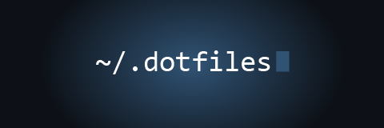

<!-- PROJECT SHIELDS -->
[![Contributors][contributors-shield]][contributors-url]
[![Forks][forks-shield]][forks-url]
[![Stargazers][stars-shield]][stars-url]
[![Issues][issues-shield]][issues-url]
[![License][license-shield]][license-url]

<!-- PROJECT LOGO -->
 

  

<h3 align="center">Configuration Files</h3>

  

  This is a collection of my custom bash, vim, and supporting configuration files, designed to streamline and enhance the development environment.
     
    <a href="https://github.com/onealcreations/dotfiles"><strong>Explore the docs »</strong></a>
     
     
    <a href="https://github.com/onealcreations/dotfiles">View Demo</a>
    ·
    <a href="https://github.com/onealcreations/dotfiles/issues">Report Bug</a>
    ·
    <a href="https://github.com/onealcreations/dotfiles/issues">Request Feature</a>
  

<!-- TABLE OF CONTENTS -->

  
Table of Contents

  <ol>
    <li>
      <a href="#about-the-project">About The Project</a>
      <ul>
        <li><a href="#built-with">Built With</a></li>
      </ul>
    </li>
    <li>
      <a href="#getting-started">Getting Started</a>
      <ul>
        <li><a href="#prerequisites">Prerequisites</a></li>
        <li><a href="#installation">Installation</a></li>
      </ul>
    </li>
    <li><a href="#usage">Usage</a></li>
    <li><a href="#roadmap">Roadmap</a></li>
    <li><a href="#contributing">Contributing</a></li>
    <li><a href="#license">License</a></li>
    <li><a href="#contact">Contact</a></li>
    <li><a href="#acknowledgments">Acknowledgments</a></li>
  </ol>

<!-- ABOUT THE PROJECT -->
## About The Project

Project Details

(<a href="#readme-top">back to top</a>)

### Built With

<!-- * [![Python][Python]][Python-url] -->
* [![vim][vim]][vim-url]
* [![bash][bash]][bash-url]

(<a href="#readme-top">back to top</a>)

<!-- GETTING STARTED -->
## Getting Started

Coming soon.

(<a href="#readme-top">back to top</a>)

<!-- USAGE EXAMPLES -->
## Usage

Coming soon.

_For more examples, please refer to the [Documentation](https://example.com)_

(<a href="#readme-top">back to top</a>)

<!-- ROADMAP -->
## Roadmap

- [ ] Installation script to propogate the configuration files to the correct directories. 

See the [open issues](https://github.com/onealcreations/dotfiles/issues) for a full list of proposed features *(and known issues)*.

(<a href="#readme-top">back to top</a>)

<!-- CONTRIBUTING -->
## Contributing

Contributions are what make the open source community such an amazing place to learn, inspire, and create. Any contributions you make are **greatly appreciated**.

If you have a suggestion that would make this better, please fork the repo and create a pull request. You can also simply open an issue with the tag "enhancement".
Don't forget to give the project a star! Thanks again!

1. Fork the Project
2. Create your Feature Branch (`git checkout -b feature/AmazingFeature`)
3. Commit your Changes (`git commit -m 'Add some AmazingFeature'`)
4. Push to the Branch (`git push origin feature/AmazingFeature`)
5. Open a Pull Request

(<a href="#readme-top">back to top</a>)

<!-- LICENSE -->
## License

Distributed under the MIT License. See `LICENSE.md` for more information.

(<a href="#readme-top">back to top</a>)

<!-- CONTACT -->
## Contact

Benjamin O'Neal - [oneal.business@gmail.com](mailto:onealbusiness@gmail.com)

Project Link: [https://github.com/onealcreations/dotfiles](https://github.com/onealcreations/dotfiles)

(<a href="#readme-top">back to top</a>)

<!-- ACKNOWLEDGMENTS -->
## Acknowledgments

* [Brent Hurst](https://github.com/brenthurst) - For mentoring my journey in bash, vim, and linux in general.
* [Chris Dean](https://github.com/chrisdean258) - For creating the foundational .vimrc file.

(<a href="#readme-top">back to top</a>)

<!-- MARKDOWN LINKS & IMAGES -->
<!-- https://www.markdownguide.org/basic-syntax/#reference-style-links -->
[contributors-shield]: https://img.shields.io/github/contributors/onealcreations/dotfiles.svg?style=for-the-badge
[contributors-url]: https://github.com/onealcreations/dotfiles/graphs/contributors
[forks-shield]: https://img.shields.io/github/forks/onealcreations/dotfiles.svg?style=for-the-badge
[forks-url]: https://github.com/onealcreations/dotfiles/network/members
[stars-shield]: https://img.shields.io/github/stars/onealcreations/dotfiles.svg?style=for-the-badge
[stars-url]: https://github.com/onealcreations/dotfiles/stargazers
[issues-shield]: https://img.shields.io/github/issues/onealcreations/dotfiles.svg?style=for-the-badge
[issues-url]: https://github.com/onealcreations/dotfiles/issues
[license-shield]: https://img.shields.io/github/license/onealcreations/dotfiles.svg?style=for-the-badge
[license-url]: https://github.com/onealcreations/dotfiles/blob/master/LICENSE.md
[product-screenshot]: images/screenshot.png
[Python]: https://img.shields.io/badge/python-3776AB?style=for-the-badge&logo=python&logoColor=white
[Python-url]: https://python.org/
[vim]: https://img.shields.io/badge/vim-019733?style=for-the-badge&logo=vim&logoColor=white
[vim-url]: https://vim.org
[bash]: https://img.shields.io/badge/gnubash-4EAA25?style=for-the-badge&logo=gnubash&logoColor=white
[bash-url]: https://www.gnu.org/software/bash/
